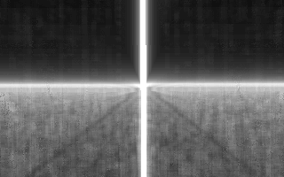

# brainlez Coders! : into the light

A 128 byte DOS intro written by pestis / bC!, compofiller to the
Lovebyte 2022 128b intro competition.

Source code: https://github.com/vsariola/into-the-light

Probably DOSBox only.

Greets to superogue, havoc, psenough, jeenio, HellMood, jobe, nesbox,
dave84, TomCat, exoticorn, ferris, Jin X, ttg, unlord, gopher, okkie,
Řrřola, hannu, wrighter, Dresdenboy, aldroid, baze, noby, p01, PoroCYon,
DevEd, byteobserver, sensenstahl, Virgill, Ped7g, gasman, LJ, ilmenit,
deater, Fready, Blossom, alia and everyone at the Sizecoding discord!

License: [MIT](LICENSE)

